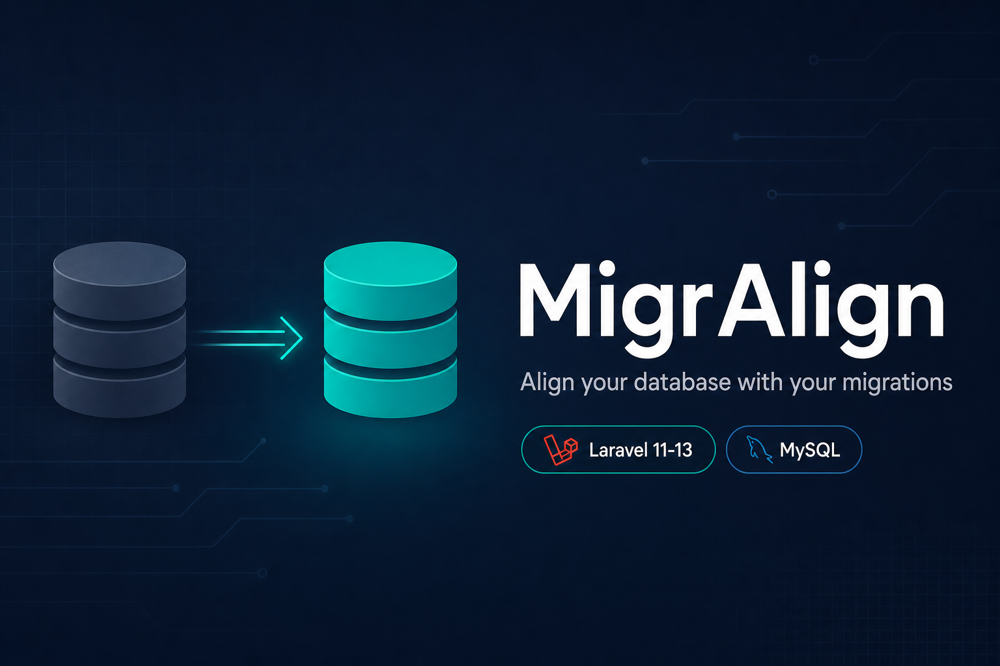

<p align="center">
  
</p>

<h1 align="center">MigrAlign</h1>

<p align="center">
  <strong>Align your database with your migrations.</strong><br>
  Detect schema drift, add missing columns, auto-apply safe updates, and get guided confirmation for risky changes.
</p>

<p align="center">
  <code>composer require migralign/laravel-migralign</code>
</p>

---

## Table of contents

- [Overview](#overview)
- [Features](#features)
- [Requirements](#requirements)
- [Installation](#installation)
- [Quick start](#quick-start)
- [How MigrAlign works](#how-migralign-works)
- [Risk model and behavior](#risk-model-and-behavior)
- [Command reference](#command-reference)
- [Configuration](#configuration)
- [Recommended workflows](#recommended-workflows)
- [Examples](#examples)
- [Limitations](#limitations)
- [Troubleshooting](#troubleshooting)
- [FAQ](#faq)
- [Publish to Packagist](#publish-to-packagist)
- [GitHub deployment guide](#github-deployment-guide)
- [Contributing](#contributing)
- [License](#license)

## Overview

MigrAlign compares your **Laravel migration-defined schema** with the **current MySQL/MariaDB schema** and helps you synchronize differences safely.

It is useful when:

- schema drift appears between migration files and real database state
- teams edit migrations and need a deterministic sync pass
- you want safe automation for additive/low-risk changes with explicit handling for risky changes

## Features

- Scans migration intent from `Schema::create()` and `Schema::table()`
- Introspects live schema from `information_schema`
- Computes table/column diffs
- Auto-applies safe changes
- Interactively prompts for risky/destructive changes
- Supports targeted sync by table or migration filename
- Supports dry-run preview and force mode
- Prints final sync report (`applied`, `skipped`, `pending manual`, `errors`)

## Requirements

- PHP 8.2+
- Laravel 11, 12, or 13
- MySQL or MariaDB connection
- PHP 8.3+ required when using Laravel 13

## Installation

Install the package:

```bash
composer require migralign/laravel-migralign
```

Publish config (optional):

```bash
php artisan vendor:publish --tag=migralign-config
```

This creates:

- `config/migralign.php`

## Quick start

1. Update your migration files.
2. Preview what would change:

```bash
php artisan migralign:sync --dry-run
```

3. Apply sync:

```bash
php artisan migralign:sync
```

## How MigrAlign works

1. **Scan migration files** from `config('migralign.migrations_path')`
2. **Build expected schema intent** from migration `up()` logic
3. **Read live schema** from MySQL `information_schema`
4. **Compute diff** for tables and columns
5. **Classify risk** for each change
6. **Apply safe changes** automatically (if enabled)
7. **Prompt for risky changes** (or skip/apply/abort)
8. **Print report**

## Risk model and behavior

MigrAlign classifies each change into one of:

- `safe`
- `risky`
- `destructive`

### Usually safe

- add nullable columns
- widen certain column sizes
- non-destructive metadata-level changes

### Usually risky

- shrinking type/length (example: `VARCHAR(255)` -> `VARCHAR(50)`)
- nullable -> not nullable
- enum contractions
- type family changes with potential conversion problems

### Usually destructive

- drop column
- drop table

For risky/destructive changes, MigrAlign shows:

- why the change is risky
- optional pre-check query
- suggested remediation SQL/instructions
- interactive choice: apply / skip / abort

## Command reference

### Main command

```bash
php artisan migralign:sync
```

### Options

- `--dry-run`  
  Show planned changes only, do not apply.

- `--force`  
  Apply risky changes without interactive prompts.

- `--table=users`  
  Limit sync to a specific table.

- `--migration=create_users`  
  Scan only migrations with matching filename text.

- `--connection=mysql`  
  Override DB connection used for introspection/apply.

### Typical command examples

```bash
# Preview everything
php artisan migralign:sync --dry-run

# Sync only users table
php artisan migralign:sync --table=users

# Preview a subset of migrations
php artisan migralign:sync --dry-run --migration=2024_01_01

# Apply all including risky (no prompts)
php artisan migralign:sync --force
```

## Configuration

Default config file:

```php
return [
    'migrations_path' => database_path('migrations'),
    'ignored_tables' => [
        'migrations',
        'password_reset_tokens',
        'sessions',
        'cache',
        'cache_locks',
        'jobs',
        'job_batches',
        'failed_jobs',
    ],
    'auto_apply_safe' => true,
    'connection' => null,
];
```

### Config keys

- `migrations_path`  
  Path to migration files used to build expected schema.

- `ignored_tables`  
  Tables excluded from diffing.

- `auto_apply_safe`  
  If `true`, safe changes apply automatically.

- `connection`  
  Default DB connection. `null` means Laravel default.

## Recommended workflows

### Workflow A: Add a new column

When you add a column in migrations (`Schema::create()` or `Schema::table()`):

```bash
php artisan migralign:sync --dry-run
php artisan migralign:sync
```

If the column is nullable or otherwise safe, it is created automatically.

### Workflow B: Risky schema tightening

For changes like `nullable(true)` -> `nullable(false)` or length shrink:

1. run `--dry-run`
2. review pre-checks and remediation
3. backfill/clean data if needed
4. run sync and confirm prompts

### Workflow C: CI safety preview

Use dry-run in CI/CD to detect unexpected drift:

```bash
php artisan migralign:sync --dry-run
```

## Examples

### Example 1: New nullable column

Migration:

```php
Schema::table('users', function (Blueprint $table) {
    $table->string('phone', 20)->nullable();
});
```

Result:

- Diff includes `add_column` for `users.phone`
- Sync applies it automatically (safe)

### Example 2: Column removed from migration intent

If a column exists in DB but not in migration intent:

- diff includes `drop_column`
- classified as destructive
- prompt asks whether to apply/skip/abort

### Example 3: Not-null tightening

Migration intent changes nullable column to not nullable:

- diff includes `modify_column`
- risky classification
- pre-check identifies violating rows when applicable

## Limitations

- Current support target is **MySQL/MariaDB only**
- Migration scanning executes migration `up()` logic in recording mode; extremely dynamic migration logic may need extra care
- Destructive actions should always be reviewed in dry-run first

## Troubleshooting

### "supports MySQL/MariaDB only"

Your selected connection is not MySQL/MariaDB.  
Use `--connection=` with a MySQL connection, or set `migralign.connection`.

### No differences found but you expect changes

- verify migration file is inside `migralign.migrations_path`
- verify `--migration=` filter is not excluding it
- ensure target table is not in `ignored_tables`

### Risky change is blocked or skipped

- run with `--dry-run` first
- follow remediation instructions
- fix data inconsistencies
- run again, or use `--force` if you explicitly accept the risk

## FAQ

### Should I edit old historical migrations?

Prefer adding new migrations for forward changes.  
Editing old migrations can create large drift expectations across environments.

### Is this a replacement for `php artisan migrate`?

No. `migrate` applies migration history; MigrAlign aligns current schema intent to live schema through diff + risk controls.

### Can I use this in production?

Yes, but always run dry-run first and review destructive/risky operations.

 
## Contributing

Contributions are welcome.

Suggested process:

1. fork
2. create feature branch
3. add/adjust tests
4. run `composer test`
5. submit PR

## License

MIT
